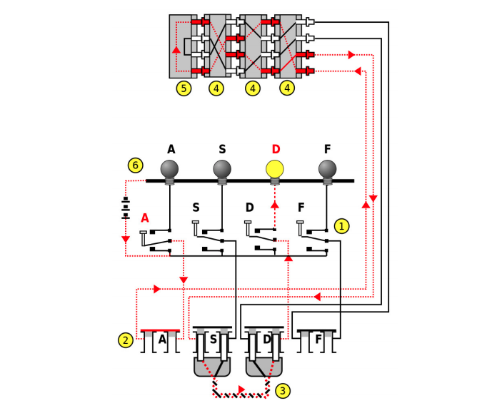

# Enigma Simulator

## Background

The key components of an Enigma machine are:
- a set of input switches (1)
- a plugboard (2) with a number of plug cables (3)
- a number of rotors (4)
- a reflector (5)
- an output board (6)

### Plugboard
The plugboard configuration files will contain an even number of numbers (possibly zero), separated by white space. The numbers are to be read off in pairs, where each pair specifies a connection made between two contacts on the plugboard. The numbers are the (0-based) index into the alphabet.

For example, the sample file plugboards/III.pb contains:

23 8 20 22 18 16 24 2 9 12

which corresponds to the plugboard where: ‘X’ is connected to ‘I’, ‘U’ is connected to ‘W’, ‘S’ is connected to ‘Q’, ‘Y’ is connected to ‘C’ and ‘J’ is connected to ‘M’. All other letters are mapped to themselves.

### Rotors
When modelling the rotors, it may be useful to keep in mind an absolute frame of reference (e.g. the 12 o’clock position) and a notion of ‘relative’ position of the rotor to this absolute frame of reference. So as the rotor rotates, its inputs and outputs move relative to this absolute frame of reference. The rotor configuration files will contain a sequence of numbers, separated by white space. The first 26 numbers specify the mapping implemented by the rotor: the first number will give the (0-based) index into the alphabet that the first letter, ‘A’, maps to; the second number will give the index for the second letter, ‘B’, and so on. The remaining numbers specify the positions on the rotor where the turnover notches are placed. Thus, if the configuration file specifies that there is a notch at 3 (i.e. the rotor’s ‘D’ position), then when the rotor rotates such that its ‘D’ position lines up with the top (‘A’) absolute position, the rotor to its left rotates by one place.

For example, the sample file shift up.rot contains:

1 2 3 4 5 6 7 8 9 10 11 12 13 14 15 16 17 18 19 20 21 22 23 24 25 0 0

This shifts the alphabet up one when mapped forwards (so ‘A’ becomes ‘B’), and down one when mapped backwards (so ‘A’ becomes ‘Z’). It also specifies that the rotor to its left should rotate one place whenever ‘A’ rotates into the top position.

### Reflector
The reflector configuration file, like the plugboard configuration file, contains an even number of numbers separated by whitespace. Unlike the plugboard file however, it must have exactly 13 pairs of numbers. These specify the mapping implemented by the reflector. Each number is again a (0-based) index into the alphabet, and each pair represents a connection, where an input on one member is reflected back as output on the other.

## To build
Run `make` to build with `makefile`.

## To run
The program is invoked on the command line and is passed configuration file names as arguments. The first configuration file specifies the wiring map for the plugboard, the second file will specify the wiring map for the reflector, the next files will specify the wiring maps for the rotors and the last file will specify the rotors’ initial starting positions.

So, for example, the following program would be configured to use three rotors and a sample plugboard and reflector as follows:
`./enigma plugboards/I.pb reflectors/I.rf rotors/I.rot rotors/II.rot rotors/III.rot rotors/I.pos`

Here the leftmost rotor would use the mapping described in I.rot, and the middle and right-hand rotors would use the mapping described in II.rot and III.rot respectively, with their starting positions specified in rotors/I.pos; the plugboard would use the mapping described in I.pb and the reflector the one in I.rf.

The program then (in a loop) reads input characters from the standard input stream. White-space characters (space, tab, carriage-return and newline) are discarded and upper case characters (A-Z) should be encrypted by the machine with the resulting upper case character output to the standard output stream. 
